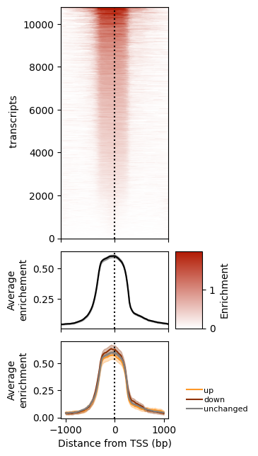
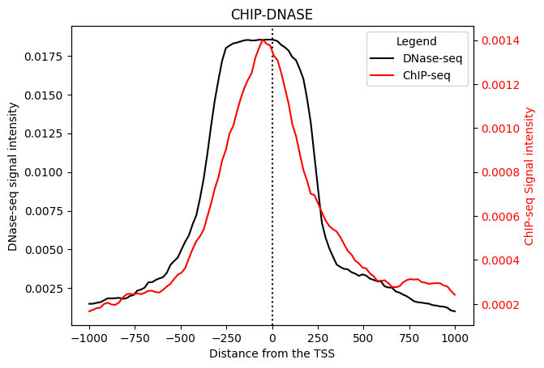
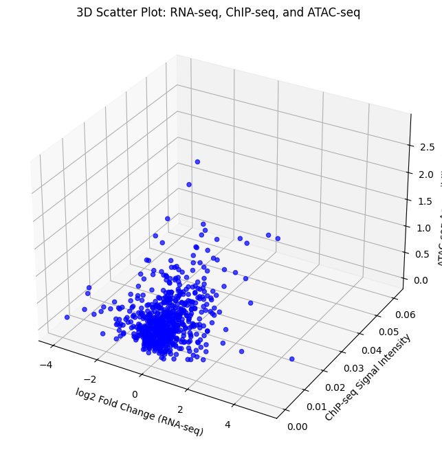
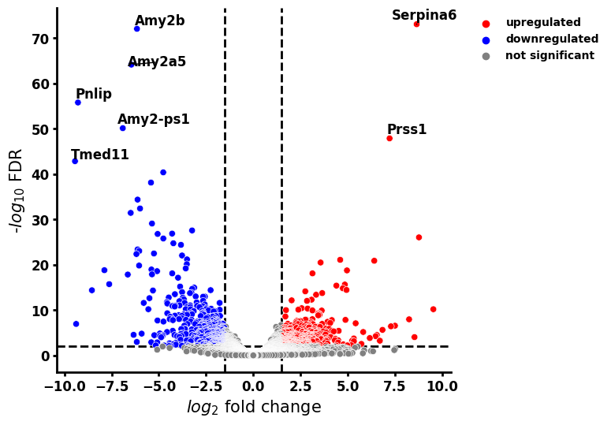
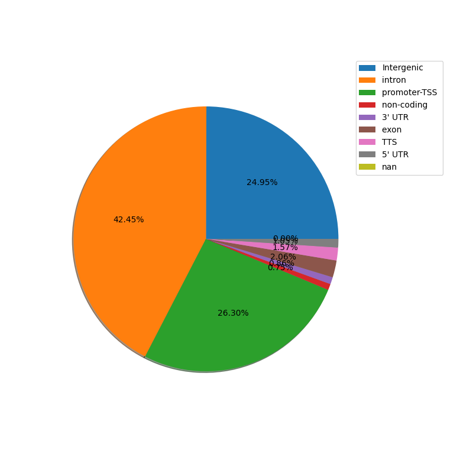
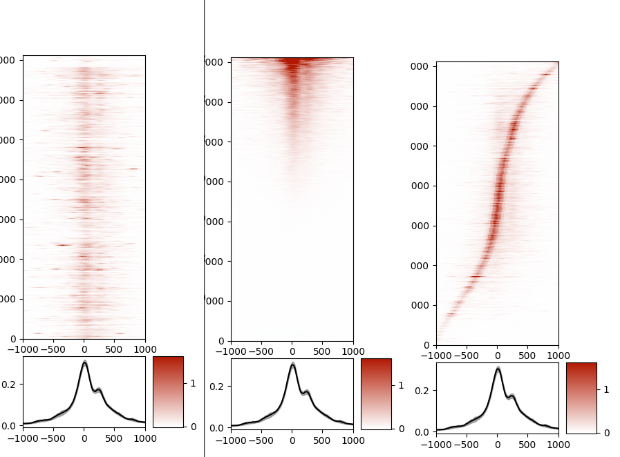

# Pyntegrate

Pyntegrate es una librería para análisis de datos genómicos, la cual se ha creado con la base de otra librería llamada [metaseq](https://github.com/daler/metaseq) creada por Ryan Dale. La actualización de dicha librería viene dada por la necesidad de análisis entre más tipos de datos. Los tipos de datos aceptados por Pyntegrate son:

1.  ChIP-seq
2.  RNA-seq
3.  DNase-seq/ATAC-seq

Teniendo estos tipos de datos aceptados por la librería, también se han creado distintas funciones para poder hacer gráficos con ellos y entre ellos para poder analizarlos entre sí.

Esta librería también hace uso del software llamado [HOMER](http://homer.ucsd.edu/homer/). Es especialmente usado para identificar los enriquecimiento de los picos de CHIP-seq y para diferenciar los distintos tipos de regiones que tiene el ADN según el intervalo.


## Instrucciones de instalación de Pyntegrate

Para instalar Pyntegrate es necesario tener github instalado.
Si se está haciendo uso de Linux se deberían de hacer los siguientes comandos:
```console
sudo apt update
sudo apt install git
```

Una vez se tiene git instalado, se debería de ejecutar el siguiente comando:

```console
pip install git+https://github.com/gerardofv02/Pyntegrate.git
```

## Instalación de HOMER

Para hacer uso de las funciones usadas de HOMER (ya que no son obligatorias de usar para usar la librería), se debería de seguir la instalación del software siguiente las instrucciones de [este link](http://homer.ucsd.edu/homer/introduction/install.html)

## Primeros pasos

Para comenzar a usar Pyntegrate, se han de tener archivos con datos genómicos cuyas extensiones pueden ser:

- bigwig, bam: Para obtener una total funcionalidad (CHIP-seq, ATAC-seq)
- bed, bigbed, gff, gtf, vcf: Tienen gran parte de funcionalidad, pero no disponen del conteo de lecturas de su archivo (CHIP-seq, ATAC-seq)
- csv: Para tener una total funcionalidad (RNA-seq)

Una vez se tengan estos datos, para poder obtener los valores de las señales en CHIP-seq y ATAC-seq y poder obtenerla como objeto dentro del código, se ha de ejecutar la siguiente función:

```python
features, signal, tsses, tsses_1kb = Pyntegrate.SeqSignalAnalysis.generate_array_simple_signal(dbPath='/path/to/transcript/data',
                                                                                                   filePath='/path/to/signal/data',
                                                                                                   extensionFile='name-of-extension-file',
                                                                                                   genome='genome',
                                                                                                   bins="number-of-subintervals-want-to-generate")
```
Para poder obtener los valores de RNA-seq, se ha de crear el siguiente objeto y se guardará como ese objeto dentro de la variable (por ejemplo de tipo DEseq2):

```python
data = Pyntegrate.results_table.DEseq2Results('/path/to/RNA.csv')
```

Una vez se han obtenido las siguientes variables, se pueden hacer una gran variedad de funciones con la señal. Estas funciones se encontrarán mejor descritas en [este link](./seqFunctions.md)

## Ejemplos de uso

A continuación, se van a explicar unos ejemplos de uso que pueden ser muy útiles para ver el funcionamiento y la extensibilidad de la librería:

### [Ejemplo 1](./example_of_use/Example_1_Pyntegrate.ipynb)

En este ejemplo se analizará CHIP-seq en un principio. Viendo así como calcular sus picos y como generar los mapas de calor para poder analizar estos. Posteriormente, se integrará RNA-seq y se hará un análisis conjunto entre sí. Un ejemplo de la gráfica generada es la siguiente:


Este ejemplo esta completo en este repositorio. El link es: [Example_1_Pyntegrate](./example_of_use/Example_1_Pyntegrate.ipynb)

### [Ejemplo 2](./example_of_use/Example_2_Pyntegrate.ipynb)

En este ejemplo se analizará DNase-seq en un principio. Se crearán mapas de calor con los valores de sus señales para, posteriormente, ser analizada conjunto a RNA-seq. Un ejemplo de la gráfica generada (parecida a la de CHIP-seq con RNA-seq) es la siguiente:



Este ejemplo esta completo en este repositorio. El link es: [Example_2_Pyntegrate](./example_of_use/Example_2_Pyntegrate.ipynb)

### [Ejemplo 3](./example_of_use/Example_3_Pyntegrate.ipynb)

En este ejemplo se analizará CHIP-seq junto con DNase-seq. El análisis por separado de cada uno de estos tipos, se encuentran en los dos ejemplos anteriores. Para el análisis de ambos tipos juntos, se generará una gráfica (con una función de Pyntegrate) como la siguiente:



Este ejemplo esta completo en este repositorio. El link es: [Example_3_Pyntegrate](./example_of_use/Example_3_Pyntegrate.ipynb)

### [Ejemplo 4](./example_of_use/Example_4_Pyntegrate.ipynb)

En este ejemplo se analizarán todos los tipos de datos juntos (CHIP-seq, RNA-seq y DNase-seq) para poder tener una visión completa del proceso.
Para ello, se han generado dos diferentes funciones de las cuales, una sirve para analizar de 2 en 2 tipos por separado, y la otra para juntar todos y analizar todos juntos, usando una gráfica de 3 dimensiones. Un ejemplo de esta gráfica sería el siguiente:



Este ejemplo esta completo en este repositorio. El link es: [Example_4_Pyntegrate](./example_of_use/Example_4_Pyntegrate.ipynb)

### [Ejemplo 5](./example_of_use/Example_5_Pyntegrate.ipynb)

En este ejemplo se realizará una gráfica de tipo volcano para poder analizar los datos de tipo RNA-seq. En ella se puede ver qué genes están reprimidos, expresivos y normales. Además, se podrá ver, si se desea, el nombre del gen en estos puntos. Un ejemplo de esta gráfica es el siguiente:



Este ejemplo esta completo en este repositorio. El link es: [Example_5_Pyntegrate](./example_of_use/Example_5_Pyntegrate.ipynb)

### [Ejemplo 6](./example_of_use/Example_6_Pyntegrate.py)

En este ejemplo se va a ver como generar un diagrama circular donde, pasándole un archivo creado por la función de HOMER de ver los tipos de anotaciones, se podrá ver los distintos porcentajes de los distintos tipos de anotaciones de dicho archivo. Para ello, una gráfica de ejemplo puede ser la siguiente:



Este ejemplo esta completo en este repositorio. El link es: [Example_6_Pyntegrate](./example_of_use/Example_6_Pyntegrate.py)

### [Ejemplo 7](./example_of_use/Example_7_Pyntegrate.py)

En este ejemplo, se generarán mapas de calor de forma repetitiva variando los datos. Los datos de donde salen los mapas de calor son los tipos de anotaciones. Es decir, se van a ir generando mapas de calor distintos según el tipo de anotación que se tenga, especialmente para poder analizar los tipos por separado. Un ejemplo de los mapas de calor generados puede ser la siguiente imagen (en este caso sería Promoter):



Este ejemplo esta completo en este repositorio. El link es: [Example_7_Pyntegrate](./example_of_use/Example_7_Pyntegrate.py)
